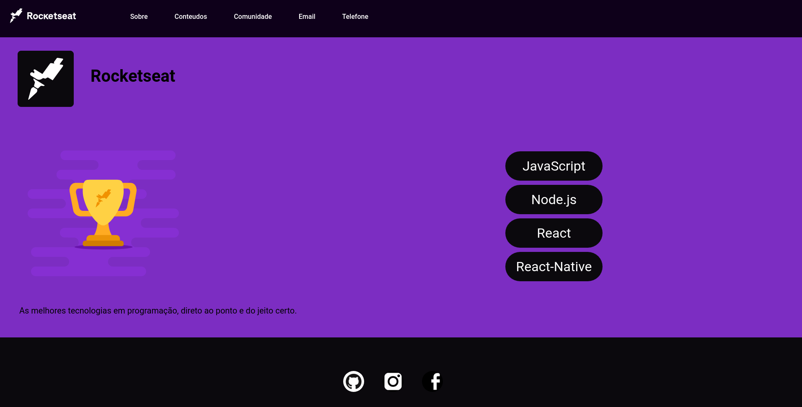
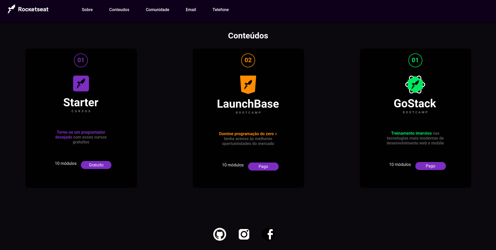
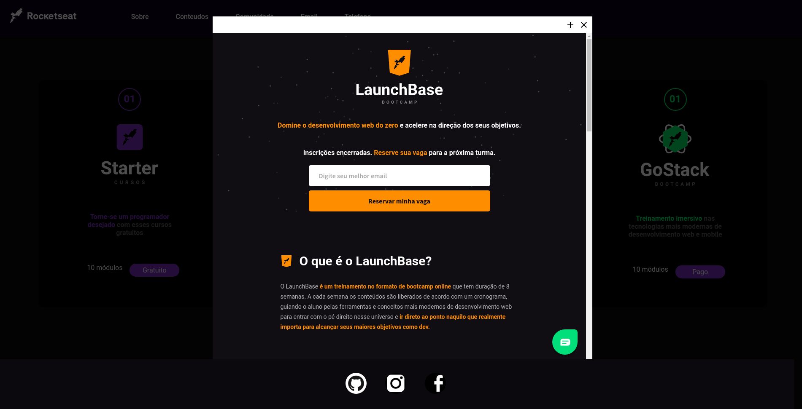
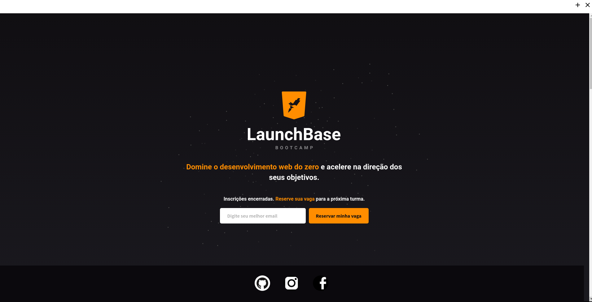
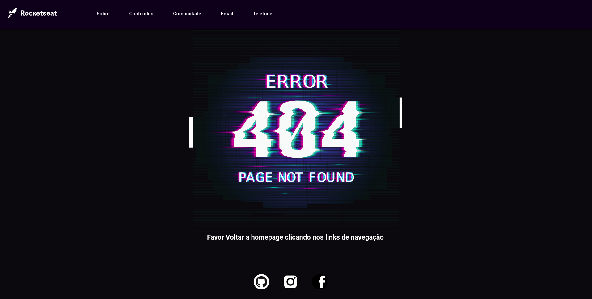

<h1 align="center">
    
</h1>

Primeiro Desafio do Bootcamp da Rocketseat

  

<h1 align="center">Screenshots dos desafios concluidos</h1>

<h1 align="center">
    
</h1>

<h1 align="center">
    
</h1>

<h1 align="center">
    
</h1>

<h1 align="center">
    
</h1>

<h1 align="center">
    
</h1>

## :rocket: Tecnologias Utilizadas

O projeto está sendo desenvolvido utilizando as seguintes tecnologias

- HTML
- CSS
- JavaScript
- Node.js
- Nunjucks
